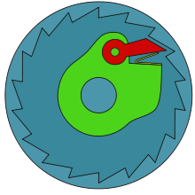

# Project planning
## Bluetooth Door Shutter

#### Problem: my dog always opens my door when im sleeping.

#### Solution: get my alexa to do it!

## Planning

### Method 1
#### the pulley method
a small pulley system mounted to my door, powered by bluetooth, that will contract at my comand, shutting my door.
[](20210124_184741.jpg)

[](220px-Roue_libre_cliquet.svg.png)

this will be much more cost effective as opposed to the other methods.  however there is much more room for error, and I predict that it will be prone to breaking.

### Method 2
#### Hydrolics
A system similar to what you see in a super market, a mydrolic system that will automatically close the door by extending
[](20210124_185844.jpg)


this solution is pretty expensive (about 98 dollars), but wouldnt be nearly as challenging to implament as the pulley will. 

###### (I doubt this will be the method I choose, but thought it was worthwhile to put down as it was an idea I had at least)

### Hurdles

Currently, through a small amount of research, I bleive the only way to connect to bluetooth using python is with PyBlues, which was made for python 3.0.  Which is pretty out of date.  not to mention I dont Currently know how to connect to the alexa from there.  funding is possibly another issue as I am a broke ass teenager, and bluetooth chips are pretty expensive, I plan on asking wether the sigma lab has any spares, but I doubt they do. 

## Code:
#### Prototype
```python
import board
#import time
from time import sleep
import servo
import pulseio
import touchio
from digitalio import DigitalInOut, Direction, Pull

button1 = DigitalInOut(board.D4)
button1.direction = Direction.INPUT
button1.pull = Pull.UP

# create a PWMOut object on Pin A2.
pwm = pulseio.PWMOut(board.A2, duty_cycle=2 ** 15, frequency=50)
 
# Create a servo object, my_servo.
my_servo = servo.Servo(pwm)


while True:
    #print("ITS WORKING! ITS WORKING!")
    print(button1.value)
    if not button1.value:
        my_servo.angle = 180
    if button1.value:
        my_servo.angle = 90
    sleep(0.05)
   ```
## CAD
Capture (2).PNG
